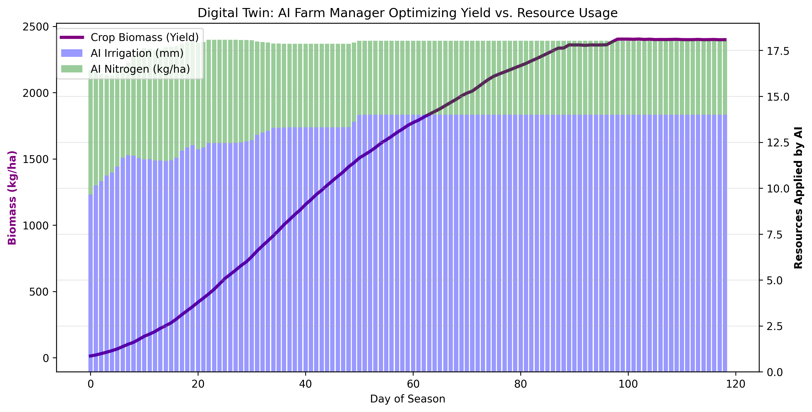
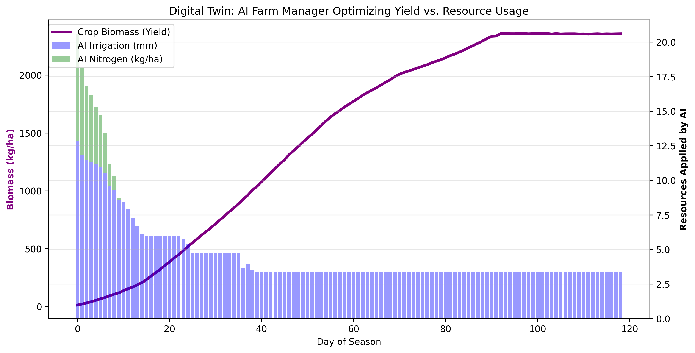

# AgriTwin-RL: Executable Digital Twin for Agricultural Optimization

## 📌 Project Overview
AgriTwin-RL is a Reinforcement Learning pipeline designed to optimize agricultural resource management. By training an AI agent against an XGBoost-powered surrogate model of crop biophysics, this system autonomously discovers policies that maximize crop yield (biomass) while strictly minimizing resource waste (irrigation and nitrogen runoff).

**Goal:** Bridge the gap between slow biological simulations and rapid AI decision-making using a Multi-Output Surrogate Model and Proximal Policy Optimization (PPO).

## 🏗️ Architecture & Pipeline
1. **Biophysical Simulation (`01_data_generator.py`):** Generates synthetic daily telemetry for crop growth.
2. **Surrogate Modeling (`02_train_surrogate.py`):** Trains an XGBoost Multi-Output Regressor to predict the next-day state of the farm.
3. **Reinforcement Learning (`03_train_rl_agent.py`):** Wraps the surrogate model in a custom `Gymnasium` environment and trains a PPO agent.

## ⚙️ Tech Stack
* **Machine Learning:** XGBoost, Scikit-Learn
* **Reinforcement Learning:** Stable-Baselines3 (PPO), Gymnasium
* **Data Processing & Visualization:** Pandas, NumPy, Matplotlib

## 🚀 How to Run Locally
```bash
git clone https://github.com/Rdargie/AgriTwin-RL.git
cd AgriTwin-RL
conda env create -f environment.yml
conda activate agritwin
python src/01_data_generator.py
python src/02_train_surrogate.py
python src/03_train_rl_agent.py

## 📊 Key Results

### Phase 1: The Baseline (10,000 Steps)
The AI successfully learned the crop's S-curve growth pattern. However, because it was under-trained, it failed to fully optimize resource costs after the plant reached maturity.



### Phase 2: Reward Hacking (100,000 Steps)
As training scaled, the agent discovered a loophole in the environment's reward structure. Since water was penalized too lightly and there was no physical penalty for over-saturation, the agent maximized its reward by over-irrigating to guarantee peak biomass. This perfectly demonstrates how AI optimizes exactly for the given reward function, highlighting the importance of strict hyperparameter tuning in simulated environments.


```
